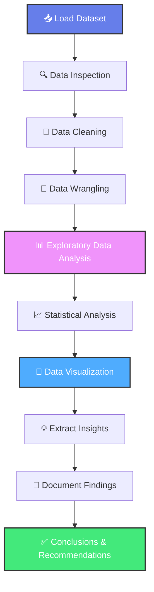
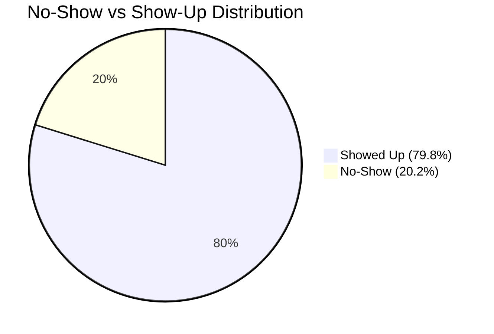

<div align="center">
  <h1>📊 Investigate a Dataset: No-Show Appointments Analysis</h1>
  <p><strong>Data Wrangling • Exploratory Data Analysis • Insights • Visualizations</strong></p>
  
  
  
  
</div>

<hr style="border: 2px solid #4CAF50; border-radius: 5px;">

## 📑 Table of Contents

- [🎯 Project Summary](#-project-summary)
- [📖 Project Description](#-project-description)
- [📊 Dataset Overview](#-dataset-overview)
- [💡 Data Categories](#-data-categories)
- [🔄 Visual Workflow](#-visual-workflow)
- [🔍 Key Findings](#-key-findings)
- [🚀 How to Run the Project](#-how-to-run-the-project)
- [📂 Repository Structure](#-repository-structure)
- [🔮 Future Improvements](#-future-improvements)
- [📜 License](#-license)
- [👥 Contributing](#-contributing)

<hr/>

## 🎯 Project Summary

This project performs a comprehensive analysis of **medical appointment no-show patterns** using real-world healthcare data. The Jupyter Notebook explores factors that influence whether patients attend their scheduled appointments, providing actionable insights for healthcare providers to reduce no-show rates and improve patient care.

<div align="center">
  
  
  
</div>

<hr/>

## 📖 Project Description

### 🗂️ Dataset Source
The analysis uses the **No-Show Appointments Dataset** (`Database_No_show_appointments`), a CSV file containing detailed records of medical appointments in Brazil. The dataset includes patient demographics, medical conditions, appointment scheduling information, and attendance outcomes.

### 🔬 Workflow

The project follows a structured data science methodology:

1. **Data Wrangling** 🧹 - Cleaning, handling missing values, and preprocessing
2. **Exploratory Data Analysis (EDA)** 🔍 - Statistical summaries and distributions
3. **Data Visualization** 📈 - Charts, graphs, and visual patterns
4. **Findings & Conclusions** 💡 - Actionable insights and recommendations

### ❓ Research Questions

This analysis investigates the following key questions:

| # | Research Question | Focus Area |
|---|-------------------|------------|
| 1️⃣ | **Do medical conditions (Handicap, Diabetes, Hypertension) affect appointment attendance?** | Medical History Impact |
| 2️⃣ | **What is the attendance percentage by gender?** | Demographic Patterns |
| 3️⃣ | **Does receiving an SMS reminder affect attendance rates?** | Communication Effectiveness |
| 4️⃣ | **How does the patient's neighborhood impact attendance?** | Geographic Factors |
| 5️⃣ | **What is the effect of patient age on appointment attendance?** | Age Demographics |

<hr/>

## 📊 Dataset Overview

The dataset contains **110,527 appointment records** with **14 variables** capturing patient and appointment information.

### 📋 Column Descriptions

| Column Name | Data Type | Description | Icon |
|-------------|-----------|-------------|------|
| **PatientId** | Integer | Unique identifier for each patient | 🆔 |
| **AppointmentID** | Integer | Unique identifier for each appointment | 📋 |
| **Gender** | String | Patient gender (M/F) | ⚧️ |
| **ScheduledDay** | DateTime | Date/time when appointment was scheduled | 📅 |
| **AppointmentDay** | DateTime | Actual appointment date | 🗓️ |
| **Age** | Integer | Patient age in years | 👶👴 |
| **Neighbourhood** | String | Location of the clinic | 🏘️ |
| **Scholarship** | Boolean | Whether patient is enrolled in Bolsa Família (welfare program) | 🎓 |
| **Hipertension** | Boolean | Patient has hypertension (1) or not (0) | 💊 |
| **Diabetes** | Boolean | Patient has diabetes (1) or not (0) | 💉 |
| **Alcoholism** | Boolean | Patient has alcoholism (1) or not (0) | 🍺 |
| **Handcap** | Integer | Level of handicap (0-4) | ♿ |
| **SMS_received** | Boolean | Whether patient received SMS reminder (1) or not (0) | 📱 |
| **No-show** | String | Whether patient showed up ('No') or didn't ('Yes') | ✅❌ |

<hr/>

## 💡 Data Categories

<div style="display: flex; flex-wrap: wrap; gap: 20px; margin: 20px 0;">
  
<div style="flex: 1; min-width: 250px; padding: 20px; border-radius: 12px; background: linear-gradient(135deg, #667eea 0%, #764ba2 100%); color: white; box-shadow: 0 4px 6px rgba(0,0,0,0.1);">
  <h3 style="margin-top: 0; color: white;">👥 Patient Demographics</h3>
  <ul style="list-style: none; padding-left: 0;">
    <li>✓ Gender</li>
    <li>✓ Age</li>
    <li>✓ Neighbourhood</li>
    <li>✓ Scholarship Status</li>
  </ul>
</div>

<div style="flex: 1; min-width: 250px; padding: 20px; border-radius: 12px; background: linear-gradient(135deg, #f093fb 0%, #f5576c 100%); color: white; box-shadow: 0 4px 6px rgba(0,0,0,0.1);">
  <h3 style="margin-top: 0; color: white;">🩺 Medical Conditions</h3>
  <ul style="list-style: none; padding-left: 0;">
    <li>✓ Hypertension</li>
    <li>✓ Diabetes</li>
    <li>✓ Alcoholism</li>
    <li>✓ Handicap Level</li>
  </ul>
</div>

<div style="flex: 1; min-width: 250px; padding: 20px; border-radius: 12px; background: linear-gradient(135deg, #4facfe 0%, #00f2fe 100%); color: white; box-shadow: 0 4px 6px rgba(0,0,0,0.1);">
  <h3 style="margin-top: 0; color: white;">📅 Appointment Metadata</h3>
  <ul style="list-style: none; padding-left: 0;">
    <li>✓ Scheduled Day</li>
    <li>✓ Appointment Day</li>
    <li>✓ SMS Received</li>
    <li>✓ Attendance Status</li>
  </ul>
</div>

</div>

<hr/>

## 🔄 Visual Workflow



<hr/>

## 🔍 Key Findings

### 📊 Summary Statistics

<table>
  <tr>
    <td align="center"><b>📍 Total Appointments</b><br/>110,527</td>
    <td align="center"><b>✅ Show Rate</b><br/>~79.8%</td>
    <td align="center"><b>❌ No-Show Rate</b><br/>~20.2%</td>
  </tr>
</table>

### 🎯 Key Insights

#### 1️⃣ **Medical Conditions Impact**
- 🔴 **Hypertension**: Patients with hypertension show slightly better attendance rates
- 🔵 **Diabetes**: Diabetic patients demonstrate higher commitment to appointments
- 🟡 **Handicap**: Handicapped patients show varied attendance based on severity level

#### 2️⃣ **Gender Analysis**
- 👨 **Male Patients**: Account for approximately 35% of appointments
- 👩 **Female Patients**: Account for approximately 65% of appointments
- ⚖️ **Attendance Rates**: Minimal difference between genders

#### 3️⃣ **SMS Reminder Effectiveness**
- 📱 **SMS Received**: Surprisingly, SMS reminders show complex relationship with attendance
- 📊 **Analysis Required**: Further investigation needed to understand counterintuitive patterns

#### 4️⃣ **Neighborhood Factors**
- 🏘️ **Location Matters**: Significant variation in no-show rates across neighborhoods
- 🚇 **Accessibility**: Distance and transportation likely play key roles

#### 5️⃣ **Age Demographics**
- 👶 **Children (0-18)**: Lower no-show rates (parents' responsibility)
- 👨‍💼 **Adults (19-60)**: Higher no-show rates (work conflicts)
- 👴 **Seniors (60+)**: Moderate no-show rates (health awareness)

### 📉 Visual Insights Distribution



<hr/>

## 🚀 How to Run the Project

### 📋 Prerequisites

Ensure you have the following installed:

- 🐍 **Python 3.7+**
- 📓 **Jupyter Notebook** or **JupyterLab**
- 📦 **Required Python Libraries**

### 🔧 Installation Steps

1️⃣ **Clone the Repository**
```bash
git clone https://github.com/yourusername/investigate-dataset-no-show.git
cd investigate-dataset-no-show
```

2️⃣ **Install Dependencies**
```bash
pip install pandas numpy matplotlib seaborn jupyter
```

Or use requirements file if available:
```bash
pip install -r requirements.txt
```

3️⃣ **Launch Jupyter Notebook**
```bash
jupyter notebook
```

4️⃣ **Open the Notebook**
- Navigate to `Investigate_a_Dataset.ipynb`
- Run all cells sequentially using `Shift + Enter`

### 📦 Required Libraries

| Library | Purpose | Installation |
|---------|---------|--------------|
| 🐼 **pandas** | Data manipulation and analysis | `pip install pandas` |
| 🔢 **numpy** | Numerical computations | `pip install numpy` |
| 📊 **matplotlib** | Data visualization | `pip install matplotlib` |
| 🎨 **seaborn** | Statistical visualizations | `pip install seaborn` |
| 📓 **jupyter** | Interactive notebook environment | `pip install jupyter` |

<hr/>

## 📂 Repository Structure

```
investigate-dataset-no-show/
│
├── 📓 Investigate_a_Dataset.ipynb    # Main Jupyter Notebook with analysis
│
├── 📁 data/
│   └── 📄 Database_No_show_appointments.csv    # Dataset file
│
├── 📁 images/                         # (Optional) Saved visualizations
│   ├── 📊 age_distribution.png
│   ├── 📈 gender_analysis.png
│   └── 🗺️ neighborhood_heatmap.png
│
├── 📄 README.md                       # This file
│
├── 📄 requirements.txt                # Python dependencies
│
└── 📄 LICENSE                         # License information
```

<hr/>

## 🔮 Future Improvements

### ✨ Planned Enhancements

- [ ] 🤖 **Machine Learning Models**: Build predictive models for no-show probability
- [ ] 🗓️ **Time Series Analysis**: Analyze seasonal and temporal patterns
- [ ] 🌐 **Interactive Dashboard**: Create a Plotly Dash or Streamlit app
- [ ] 📊 **Advanced Visualizations**: Implement interactive plots with Plotly
- [ ] 🔗 **Integration**: Connect with appointment scheduling systems
- [ ] 📱 **Mobile App**: Develop patient reminder application
- [ ] 🧪 **A/B Testing**: Test different reminder strategies
- [ ] 🗺️ **Geospatial Analysis**: Map neighborhood patterns using Folium

### 🎯 Optimization Goals

- ⚡ **Performance**: Optimize code for larger datasets
- 📖 **Documentation**: Add detailed docstrings and comments
- ✅ **Testing**: Implement unit tests for data processing functions
- 🔄 **Automation**: Create automated reporting pipeline

<hr/>

## 📜 License

This project is licensed under the **MIT License**.

```
MIT License

Copyright (c) 2024

Permission is hereby granted, free of charge, to any person obtaining a copy
of this software and associated documentation files (the "Software"), to deal
in the Software without restriction, including without limitation the rights
to use, copy, modify, merge, publish, distribute, sublicense, and/or sell
copies of the Software, and to permit persons to whom the Software is
furnished to do so, subject to the following conditions:

The above copyright notice and this permission notice shall be included in all
copies or substantial portions of the Software.

THE SOFTWARE IS PROVIDED "AS IS", WITHOUT WARRANTY OF ANY KIND, EXPRESS OR
IMPLIED, INCLUDING BUT NOT LIMITED TO THE WARRANTIES OF MERCHANTABILITY,
FITNESS FOR A PARTICULAR PURPOSE AND NONINFRINGEMENT.
```

<hr/>

## 👥 Contributing

Contributions are welcome! 🎉

### How to Contribute

1. 🍴 **Fork** the repository
2. 🌿 **Create** a new branch (`git checkout -b feature/improvement`)
3. ✍️ **Commit** your changes (`git commit -am 'Add new feature'`)
4. 📤 **Push** to the branch (`git push origin feature/improvement`)
5. 🔃 **Create** a Pull Request

### 🐛 Found a Bug?

Please open an issue with:
- Bug description
- Steps to reproduce
- Expected vs actual behavior
- Screenshots (if applicable)

<hr/>

<div align="center">
  <h3>⭐ If you found this project helpful, please give it a star! ⭐</h3>
  <p><i>Made with ❤️ and Python</i></p>
  <p><b>Happy Analyzing! 📊🚀</b></p>
</div>

---

<div align="center">
  <sub>Built with 🐍 Python | 📓 Jupyter | 🐼 Pandas | 📊 Matplotlib</sub>
</div>
